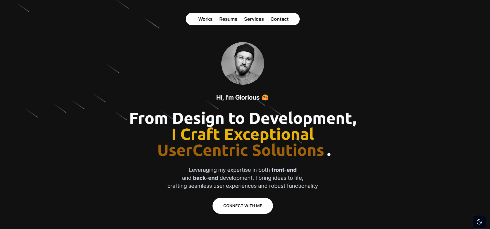

<div align="center">
  <br />
    <a href="https://glorious-portfolio.vercel.app/" target="_blank">
      
    </a>
  <br />

  <div>
    
    
    
    
    
  </div>

  <h3 align="center">A Modern Next.js Portfolio</h3>

   <p align="center">
     A portfolio to establish your online presence as a developer and attract potential customers.
    </p>
</div>

## 📋 <a name="table">Table of Contents</a>

1. 🤖 [Introduction](#introduction)
2. ⚙️ [Tech Stack](#tech-stack)
3. 🤸 [Quick Start](#quick-start)

## <a name="introduction">🤖 Introduction</a>

Built with Next.js to manage the user interface, Framer motion for beautiful animations, and styled with TailwindCSS, this portfolio demonstrates the developer's skills in a unique way that creates a lasting impact.

If you need help or run into bugs, drop me a line and let's talk. [Théo Balick](mailto:balickmethens@gmail.com)

WhatsApp: [+243 893 666 998](https://wa.me/+33620505050)

## <a name="tech-stack">⚙️ Tech Stack</a>

- Next.js
- Framer Motion
- Tailwind CSS

## <a name="quick-start">🤸 Quick Start</a>

Follow these steps to set up the project locally on your machine.

**Prerequisites**

Make sure you have the following installed on your machine:

- [Git](https://git-scm.com/)
- [Node.js](https://nodejs.org/en)
- [npm](https://www.npmjs.com/) (Node Package Manager)

**Cloning the Repository**

```bash
git clone https://github.com/Balick/glorious-portfolio.git
cd glorious-portfolio
```

**Installation**

Install the project dependencies using npm:

```bash
npm install
```

**Running the Project**

```bash
npm run dev
```

Open [http://localhost:3000](http://localhost:3000) in your browser to view the project.
